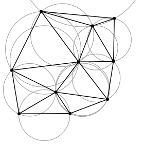

# errorgeopy
Python geocoding in a disagreeing world

<!-- pandoc --from=markdown --to=rst --output=README.rst README.md -->

 [](https://pypi.python.org/pypi/errorgeopy) 
<!-- [](https://coveralls.io/github/alpha-beta-soup/errorgeopy?branch=master) -->

Wraps [geopy](https://github.com/geopy/geopy) geocoding to expose a simple way to use multiple providers of geocoding services simultaneously (with `multiprocessing`), and provide a report of the ensuing spatial uncertainty in the final location.

0. Configure your desired/allowed geocoding providers (YAML or JSON file or Python dictionary).
1. (Forward) geocode an address using the errorgeopy `geocode` wrapper around geopy's geocoding implementations.
2. Recieve a multipoint of the geocoded address locations, the [convex hull](http://scipy.github.io/devdocs/generated/scipy.spatial.ConvexHull.html) of the result locations, the [concave hull](http://blog.thehumangeo.com/2014/05/12/drawing-boundaries-in-python/) of the results, various types of centroid, and quantitative measures of spatial agreement across component providers (clustering)—as well as maintaining access to the original results.

Reverse geocoding is also supported (again wrapping geopy), in which case errorgeopy supports: de-duplicating results (with a similarity threshold); extracting results that match a pre-determined bias (e.g. if you only want to retain results that fuzzily match a particular suburb or street name); and identifying the longest common substring amongst candidate addresses.

# Installation

Requires Python 3; only tested with Python 3.4

`pip install errorgeopy`

# Documentation

Using Sphinx.

Initially, with autodoc:

```sh
cd docs/
sphinx-apidoc -f -o source/ ../errorgeopy/
```

Then make any desired changes in `docs/source/` and run:

```sh
make html
```

<!-- TODO  make available on ReadTheDocs and leave a link here -->

## Dependencies

- `geopy`
- `shapely` (outputs generally are `shapely.geometry` types in geographic coordinates, to get that sweet `__geo_interface__`)
- `scikit-learn` (cluster detection)
- `scipy` (for Delaunay triangulation for concave hulls)
- `pyproj` (so I can work smarter with distances when clustering)



# Why?

Geocoding is very hard, although consumer-grade APIs make the process seem very easy. Intuitively, it does seem easy: address goes in, point comes out. [That's what Osaka Seafood Concern is all about. Every truckload of addresses you geocode brings you 31 cents closer to those tickets home!](https://www.youtube.com/watch?v=cIosb69x9iI)

But what if two different geocoding services both claim a successful address-level match, but the output location is different? If it is a subtle difference, it probably doesn't matter, especially if both addresses are within the same parcel. If it is a significant difference, it is possible that the two services have identified an ambiguity in the input address, or that one of them is just wrong, or that one of them can only match down to the suburb, and not the street or numberered address. Using more services may help you identify such a situtation and ignore such "minority opinions". **This is exactly what errorgeopy can do for you.**

For example, by making requests to *multiple geocoding services*, errorgeopy can return identified clusters of addresses, in order, with the first cluster being the largest:

```python
>>> from errorgeopy.geocoders import GeocoderPool
>>> # Optionally, can also get geocoder configuration from a file, or a dict
>>> g_pool = GeocoderPool() # Use default, free, no sign-up geocoding APIs
>>> test = 'High Street, Lower Hutt, New Zealand'
>>> location = g_pool.geocode(test)
>>> for cl in location.clusters:
>>>    print(cl, cl.geom, cl.location.mbc) # Cluster, cluster multipoint, cluster minimum bounding circle
# pretty-printing this a little
Cluster(
  label=0,
  centroid=<shapely.geometry.point.Point object at 0x7fad9f5903c8>,
  geom=<shapely.geometry.multipoint.MultiPoint object at 0x7fad9f590358>,
  location=
    Location(High Street, Taita, Lower Hutt, Lower Hutt City, Wellington, 5011, New Zealand, (-41.166847, 174.9673, 0.0))
    Location(High Street, Boulcott, Lower Hutt, Lower Hutt City, Wellington, 5040, New Zealand, (-41.2034803, 174.9215726, 0.0))
    Location(High Street, Avalon, Lower Hutt, Lower Hutt City, Wellington, 5011, New Zealand, (-41.1890827, 174.9522785, 0.0))
    Location(High Street, Manor Park, Lower Hutt, Lower Hutt City, Wellington, 5011, New Zealand, (-41.1662641, 174.9716431, 0.0))
  )
  MULTIPOINT Z (174.9673 -41.166847 0, 174.9215726 -41.2034803 0, 174.9522785 -41.1890827 0, 174.9716431 -41.1662641 0)
  POLYGON ((174.9778012007045 -41.1848722, 174.9776509961948 -41.18792968303335, 174.9772018292174 -41.1909577208337, 174.9764580254958 -41.19392715174174, 174.9754267482663 -41.19680937851456, 174.9741179292926 -41.19957664373276, 174.9725441732167 -41.20220229711955, 174.97072063617 -41.20466105219749, 174.9686648798111 -41.20692922981107, 174.9663967021975 -41.20898498616997, 174.9639379471195 -41.21080852321667, 174.9613122937328 -41.21238227929256, 174.9585450285145 -41.21369109826632, 174.9556628017417 -41.21472237549576, 174.9526933708337 -41.21546617921741, 174.9496653330334 -41.21591534619483, 174.94660785 -41.21606555070448, 174.9435503669666 -41.21591534619483, 174.9405223291663 -41.21546617921741, 174.9375528982582 -41.21472237549576, 174.9346706714854 -41.21369109826632, 174.9319034062672 -41.21238227929256, 174.9292777528804 -41.21080852321667, 174.9268189978025 -41.20898498616997, 174.9245508201889 -41.20692922981107, 174.92249506383 -41.20466105219749, 174.9206715267833 -41.20220229711955, 174.9190977707074 -41.19957664373276, 174.9177889517337 -41.19680937851456, 174.9167576745042 -41.19392715174174, 174.9160138707826 -41.1909577208337, 174.9155647038052 -41.18792968303335, 174.9154144992955 -41.1848722, 174.9155647038052 -41.18181471696665, 174.9160138707826 -41.1787866791663, 174.9167576745042 -41.17581724825827, 174.9177889517337 -41.17293502148544, 174.9190977707074 -41.17016775626724, 174.9206715267833 -41.16754210288045, 174.92249506383 -41.16508334780251, 174.9245508201889 -41.16281517018894, 174.9268189978025 -41.16075941383003, 174.9292777528804 -41.15893587678333, 174.9319034062672 -41.15736212070745, 174.9346706714854 -41.15605330173369, 174.9375528982582 -41.15502202450424, 174.9405223291663 -41.15427822078259, 174.9435503669666 -41.15382905380518, 174.94660785 -41.15367884929552, 174.9496653330334 -41.15382905380518, 174.9526933708337 -41.15427822078259, 174.9556628017417 -41.15502202450424, 174.9585450285145 -41.15605330173369, 174.9613122937328 -41.15736212070745, 174.9639379471195 -41.15893587678333, 174.9663967021975 -41.16075941383003, 174.9686648798111 -41.16281517018894, 174.97072063617 -41.16508334780251, 174.9725441732167 -41.16754210288045, 174.9741179292926 -41.17016775626724, 174.9754267482663 -41.17293502148544, 174.9764580254958 -41.17581724825826, 174.9772018292174 -41.1787866791663, 174.9776509961948 -41.18181471696665, 174.9778012007045 -41.1848722))
Cluster(
  label=1,
  centroid=<shapely.geometry.point.Point object at 0x7fad9f53ef98>,
  geom=<shapely.geometry.multipoint.MultiPoint object at 0x7fad9f53e0f0>,
  location=
    Location(High St, Lower Hutt, 5010, (-41.20740676599962, 174.9066761100006, 0.0))
    Location(High Street, Boulcott, Lower Hutt, Lower Hutt City, Wellington, 5010, New Zealand, (-41.2038771, 174.9165404, 0.0))
    Location(High Street, Lower Hutt Central, Lower Hutt, Lower Hutt City, Wellington, 5010, New Zealand, (-41.2067898, 174.9079979, 0.0))
  )
  MULTIPOINT Z (174.9066761100006 -41.20740676599962 0, 174.9165404 -41.2038771 0, 174.9079979 -41.2067898 0)
  POLYGON ((174.9168466411845 -41.20564193299981, 174.9168214169233 -41.20615538463353, 174.9167459870629 -41.20666389144734, 174.9166210780342 -41.20716255624264, 174.9164478927793 -41.20764657660485, 174.9162280991671 -41.2081112911533, 174.91596381393 -41.20855222443284, 174.9156575822795 -41.20896513001495, 174.9153123533937 -41.20934603139317, 174.9149314520155 -41.20969126027898, 174.9145185464334 -41.20999749192951, 174.9140776131538 -41.21026177716656, 174.9136128986054 -41.21048157077882, 174.9131288782432 -41.21065475603366, 174.9126302134478 -41.21077966506238, 174.912121706634 -41.21085509492278, 174.9116082550003 -41.21088031918406, 174.9110948033666 -41.21085509492278, 174.9105862965528 -41.21077966506238, 174.9100876317575 -41.21065475603366, 174.9096036113953 -41.21048157077882, 174.9091388968468 -41.21026177716656, 174.9086979635673 -41.20999749192951, 174.9082850579852 -41.20969126027898, 174.907904156607 -41.20934603139317, 174.9075589277211 -41.20896513001495, 174.9072526960706 -41.20855222443284, 174.9069884108336 -41.2081112911533, 174.9067686172213 -41.20764657660485, 174.9065954319665 -41.20716255624264, 174.9064705229378 -41.20666389144734, 174.9063950930774 -41.20615538463353, 174.9063698688161 -41.20564193299981, 174.9063950930774 -41.20512848136609, 174.9064705229378 -41.20461997455228, 174.9065954319665 -41.20412130975699, 174.9067686172213 -41.20363728939477, 174.9069884108336 -41.20317257484632, 174.9072526960706 -41.20273164156679, 174.9075589277211 -41.20231873598467, 174.907904156607 -41.20193783460645, 174.9082850579852 -41.20159260572064, 174.9086979635673 -41.20128637407011, 174.9091388968468 -41.20102208883306, 174.9096036113953 -41.2008022952208, 174.9100876317575 -41.20062910996597, 174.9105862965528 -41.20050420093724, 174.9110948033666 -41.20042877107684, 174.9116082550003 -41.20040354681556, 174.912121706634 -41.20042877107684, 174.9126302134478 -41.20050420093724, 174.9131288782432 -41.20062910996597, 174.9136128986054 -41.2008022952208, 174.9140776131538 -41.20102208883306, 174.9145185464334 -41.20128637407011, 174.9149314520155 -41.20159260572064, 174.9153123533937 -41.20193783460645, 174.9156575822795 -41.20231873598467, 174.91596381393 -41.20273164156679, 174.9162280991671 -41.20317257484632, 174.9164478927793 -41.20363728939477, 174.9166210780342 -41.20412130975699, 174.9167459870629 -41.20461997455228, 174.9168214169233 -41.20512848136609, 174.9168466411845 -41.20564193299981))
Cluster(
  label=2,
  centroid=<shapely.geometry.point.Point object at 0x7fad9f56d6a0>,
  geom=<shapely.geometry.multipoint.MultiPoint object at 0x7fad9f56d1d0>,
  location=
    Location(High Street, Petone, Lower Hutt, Lower Hutt City, Wellington, 5012, New Zealand, (-41.2250375, 174.8894697, 0.0))
    Location(High Street, Lower Hutt Central, Lower Hutt, Lower Hutt City, Wellington, 5010, New Zealand, (-41.2119292, 174.8996589, 0.0))
  )
  MULTIPOINT Z (174.8894697 -41.2250375 0, 174.8996589 -41.2119292 0)
  POLYGON ((174.9028656150394 -41.21848335, 174.9028256419384 -41.21929702116113, 174.9027061075986 -41.22010285622418, 174.9025081632008 -41.22089309455698, 174.9022337150578 -41.2216601257324, 174.9018854062553 -41.22239656282091, 174.9014665911974 -41.22309531353078, 174.9009813033021 -41.22374964851068, 174.9004342161571 -41.22435326615709, 174.8998305985107 -41.22490035330207, 174.8991762635308 -41.22538564119736, 174.8984775128209 -41.22580445625525, 174.8977410757324 -41.22615276505778, 174.896974044557 -41.22642721320076, 174.8961838062242 -41.22662515759858, 174.8953779711611 -41.22674469193845, 174.8945643 -41.22678466503934, 174.8937506288389 -41.22674469193845, 174.8929447937758 -41.22662515759858, 174.892154555443 -41.22642721320076, 174.8913875242676 -41.22615276505778, 174.8906510871791 -41.22580445625525, 174.8899523364692 -41.22538564119736, 174.8892980014893 -41.22490035330207, 174.8886943838429 -41.22435326615709, 174.888147296698 -41.22374964851068, 174.8876620088026 -41.22309531353078, 174.8872431937448 -41.22239656282091, 174.8868948849422 -41.2216601257324, 174.8866204367992 -41.22089309455698, 174.8864224924014 -41.22010285622418, 174.8863029580616 -41.21929702116113, 174.8862629849607 -41.21848335, 174.8863029580616 -41.21766967883887, 174.8864224924014 -41.21686384377582, 174.8866204367992 -41.21607360544301, 174.8868948849422 -41.2153065742676, 174.8872431937448 -41.21457013717909, 174.8876620088026 -41.21387138646922, 174.888147296698 -41.21321705148932, 174.8886943838429 -41.21261343384291, 174.8892980014893 -41.21206634669793, 174.8899523364692 -41.21158105880264, 174.8906510871791 -41.21116224374475, 174.8913875242676 -41.21081393494222, 174.892154555443 -41.21053948679923, 174.8929447937758 -41.21034154240142, 174.8937506288389 -41.21022200806155, 174.8945643 -41.21018203496066, 174.8953779711611 -41.21022200806155, 174.8961838062242 -41.21034154240142, 174.896974044557 -41.21053948679923, 174.8977410757324 -41.21081393494222, 174.8984775128209 -41.21116224374475, 174.8991762635308 -41.21158105880264, 174.8998305985107 -41.21206634669793, 174.9004342161571 -41.21261343384291, 174.9009813033021 -41.21321705148932, 174.9014665911974 -41.21387138646922, 174.9018854062553 -41.21457013717909, 174.9022337150578 -41.2153065742676, 174.9025081632008 -41.21607360544301, 174.9027061075986 -41.21686384377582, 174.9028256419384 -41.21766967883887, 174.9028656150394 -41.21848335))
```

In the above, we have three identified clusters. If you know your input to be well-specified, then you might pick the larger groups, and disregard the cluster with only one member. In this case, we just have a vague input, and so should embrace the vagueness of our result. A single geocoding service with a vague input address would be considerably more constrained than this result.

There are also methods to return a complete mutlipoint geometry, a convex hull, a concave hull of the result set.

Reverse geocoding is also supported, including the ability to "seed" the result with a string that the results are scored against using fuzzy string matching. You can also obtain the longest common substring. (I'm sure there's much more that can be done with matching address string, let me know if you have an idea.)

### Reading material

- [Why does Gooogle think Vermont is in Morristown?]( http://www.sevendaysvt.com/vermont/wtf-why-does-google-think-vermont-is-in-morristown/Content?oid=3348157)

## Features & release notes

- [x] **alpha** (≤ **v0.3**) and **beta** (**v0.4**)
  - [x] Basic premise implementation: wrapping calls to multiple geocoding providers (anything supported by geopy forward geocoding)
  - [x] Available on PiPy
  - [x] Simple geometric operations on candidate addresses
    - Centroids
    - K-means clustering
    - Smallest bounding circle
    - Convex hull
    - Concave hull
    - Use of shapely as implementation of `__geo_interface__` for Python objects

- [ ] **v1.0**
  - [x] Unit testing (using `tox` and `pytest`)
  - [x] Centroids of `Location`
  - [x] Implementing `__geo_interface__` for a `Location.cluster` property
  - [x] Reverse geocoding, with string similarity algorithms as an optional reporting tool to gauge agreement, cluster, and attempt to identify the "most complete" address with a dependency on [fuzzywuzzy](http://chairnerd.seatgeek.com/fuzzywuzzy-fuzzy-string-matching-in-python/)
  - [x] Cleaner implementation of clustering
  - [x] DBSCAN clustering
  - [x] Documentation on http://readthedocs.io, built from source code
- [ ] **v1.1**
  - [ ] Affinity propagation clustering
  - [ ] Hierarchical clustering
    - Still only a vague idea in my mind, not a real plan
    - http://varianceexplained.org/r/kmeans-free-lunch/
    - https://en.wikipedia.org/wiki/Hierarchical_clustering
    - http://docs.scipy.org/doc/scipy/reference/cluster.hierarchy.html
    - Method to return a topological [dendrogram](http://docs.scipy.org/doc/scipy/reference/generated/scipy.cluster.hierarchy.dendrogram.html#scipy.cluster.hierarchy.dendrogram) of the clusters (from centre of all, branching to local centres, and finally to the leaves (actual addresses returned from services), as a geographical feature that can readily be plotted on a map

## Testing & developing

Requires [tox](http://tox.readthedocs.io/en/latest/install.html).

```
sudo tox
```

Developing locally, I like to build with `tox` and then use the environment it creates for running small applications that integrate with other things (e.g. running a Flask app that uses errorgeopy; this updates after testing simply with another `sudo tox`).


Initially, you may need to be more forceful for this:

```
$ sudo tox --recreate -e py34
$ source .tox/py34/bin/activate
$(py34) python example/app.py
```

I highly recommend tox, having never used it before this project. Please file an issue or contact @alpha-beta-soup if you have issues setting anything up.

Any issue, pull request, feature request, or general comment is more than welcome. I really lke Github issues as a method of organisation.

# Acknowledgements

This has been the first Python project that I've really taken care of trying to make generally accessible to the public in a standard manner. I'm rather indebted to Jeff Knupp's blog post, [*Open Sourcing a Python Project the Right Way*](https://jeffknupp.com/blog/2013/08/16/open-sourcing-a-python-project-the-right-way/). Any tips appreciated, I'm looking forward to getting even more under my belt.
